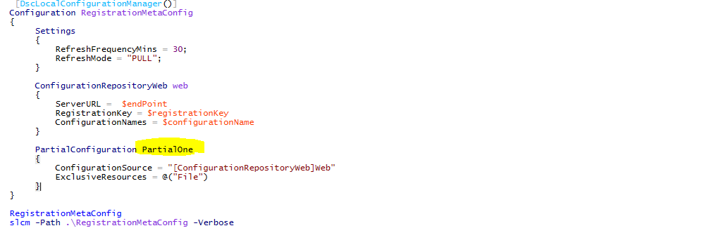
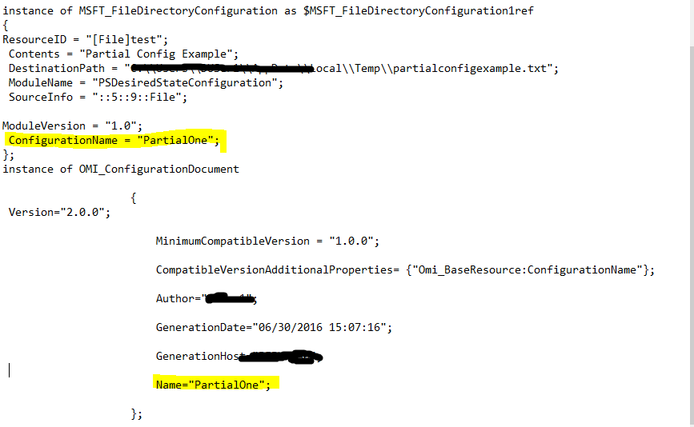

#Improvements in Desired State Configuration (DSC) in WMF 5.1

## DSC class resource improvements

In WMF 5.1, we have fixed the following known issues:
* Get-DscConfiguration may return empty values (null) or errors if a complex/hash table type is returned by Get() function of a class-based DSC resource.
* Get-DscConfiguration returns error if RunAs credential is used in DSC configuration.
* Class-based resource cannot be used in a composite configuration.
* Start-DscConfiguration hangs if class-based resource has a property of its own type.
* Class-based resource cannot be used as an exclusive resource.


## DSC resource debugging improvements

In WMF 5.0, the PowerShell debugger did not stop at the class-based resource method (Get/Set/Test) directly.
In WMF 5.1, the debugger will stop at the class-based resource method in the same way as for MOF-based resources methods.

## DSC pull client supports TLS 1.1 and TLS 1.2 
Previously, the DSC pull client only supported SSL3.0 and TLS1.0 over HTTPS connections. 
When forced to use more secure protocols, the pull client would stop functioning. 
In WMF 5.1, the DSC pull client no longer supports SSL 3.0 and adds support for the more secure TLS 1.1 and TLS 1.2 protocols.  

## Improved pull server registration ##

In the earlier versions of WMF, simultaneous registrations/reporting requests to a DSC pull server while using the ESENT database would lead to LCM failing to register and/or report. 
In such cases, the event logs on the pull server will have the error "Instance Name already in use."
This was due to an incorrect pattern being used to access the ESENT database in a multi-threaded scenario. 
In WMF 5.1, this issue has been fixed. 
Concurrent registrations or reporting (involving ESENT database) will work fine in WMF 5.1. 
This issue is applicable only to the ESENT database and does not apply to the OLEDB database. 

##Pull partial configuration naming convention
In the previous release, the naming convention for a partial configuration was that the MOF file name in the pull server/service should match the partial configuration name specified in the local configuration manager settings that in turn must match the configuration name embedded in the MOF file. 

See the snapshots below:

•	Local configuration settings which defines a partial configuration that a node is allowed to receive.



•	Sample partial configuration definition 

```PowerShell
Configuration PartialOne
{
    Node('localhost')
    {
        File test 
        {
            DestinationPath = "$env:TEMP\partialconfigexample.txt"
            Contents = 'Partial Config Example'
        }
    }
}
PartialOne
```

•	'ConfigurationName' embedded in the generated MOF file.



•	FileName in the pull configuration repository 


Azure Automation service name generated MOF files as `<ConfigurationName>.<NodeName>.mof`. 
So the configuration below will compile to PartialOne.localhost.mof.

This made it impossible to pull one of your partial configuration from Azure Automation service.

```PowerShell
Configuration PartialOne
{
    Node('localhost')
    {
        File test 
        {
            DestinationPath = "$env:TEMP\partialconfigexample.txt"
            Contents = 'Partial Config Example'
        }
    }
}
PartialOne
```

In WMF 5.1, partial configuration in the pull server/service can be named as `<ConfigurationName>.<NodeName>.mof`. 
Moreover, if a machine is pulling a single configuration from a pull server/service then the configuration file on the pull server configuration repository can have any file name. 
This naming flexibility allow you to manage your nodes partially by Azure Automation service, where some configuration for your node is coming from Azure Automation DSC and you have a partial configuration that you wanted to manage locally.

The metaconfiguration below will set up a node to be managed both locally as well as by Azure Automation service.

```PowerShell
  [DscLocalConfigurationManager()]
   Configuration RegistrationMetaConfig
   {
        Settings
        {
            RefreshFrequencyMins = 30
            RefreshMode = "PULL"            
        }

        ConfigurationRepositoryWeb web
        {
            ServerURL =  $endPoint
            RegistrationKey = $registrationKey
            ConfigurationNames = $configurationName
        }

        # Partial configuration managed by Azure Automation service.
        PartialConfiguration PartialConfigurationManagedByAzureAutomation
        {
            ConfigurationSource = "[ConfigurationRepositoryWeb]Web"   
        }
    
        # This partial configuration is managed locally.
        PartialConfiguration OnPremisesConfig
        {
            RefreshMode = "PUSH"
            ExclusiveResources = @("Script")
        }

   }

   RegistrationMetaConfig
   slcm -Path .\RegistrationMetaConfig -Verbose
 ```

# Using PsDscRunAsCredential with DSC composite resources   

We have added support for using [*PsDscRunAsCredential*](https://msdn.microsoft.com/cs-cz/powershell/dsc/runasuser) with DSC [Composite](https://msdn.microsoft.com/en-us/powershell/dsc/authoringresourcecomposite) resources.    

Users can now specify a value for PsDscRunAsCredential when using composite resources inside configurations. 
When specified, all resources run inside a composite resource as a RunAs user. 
If a composite resource calls another composite resource, all of its resources are also executed as RunAs user. 
RunAs credentials are propagated to any level of the composite resource hierarchy. 
If any resource inside a composite resource specifies its own value for PsDscRunAsCredential, a merge error will result during configuration compilation.

This example shows usage with [WindowsFeatureSet](https://msdn.microsoft.com/en-us/powershell/wmf/dsc_newresources) composite resource included in PSDesiredStateConfiguration module. 


```powershell

Configuration InstallWindowsFeature     
{
    Import-DscResource -ModuleName PSDesiredStateConfiguration

    Node $AllNodes.NodeName
	{
        WindowsFeatureSet features 
        {  
            Name = @("Telnet-Client","SNMP-Service")  
            Ensure = "Present"  
            IncludeAllSubFeature = $true  
            PsDscRunAsCredential = Get-Credential   
        }  
    }

}

$configData = @{
    AllNodes = @(
        @{
            NodeName             = 'localhost'
            PSDscAllowDomainUser = $true
            CertificateFile      = 'C:\publicKeys\targetNode.cer'
            Thumbprint           = '7ee7f09d-4be0-41aa-a47f-96b9e3bdec25'
        }
    )
}


InstallWindowsFeature -ConfigurationData $configData 

```

##DSC module and configuration signing validations
In DSC, configurations and modules are distributed to managed computers from the pull server. 
If the pull server is compromised, an attacker can potentially modify the configurations and modules on the pull server and have it distributed to all managed nodes, compromising all of them. 

 In WMF 5.1, DSC supports validating the digital signatures on catalog and configuration (.MOF) files. 
 This feature will prevent nodes from executing configurations or module files which are not signed by a trusted signer or which have been tampered with after they have been signed by trusted signer. 


###How to sign configuration and module 
***
* Configuration Files (.MOFs): 
The existing PowerShell cmdlet [Set-AuthenticodeSignature](https://technet.microsoft.com/library/hh849819.aspx) is extended to support signing of MOF files.  
* Modules:
Signing of modules is done by signing the corresponding module catalog using the following steps: 
    1. Create a catalog file: A catalog file contains a collection of cryptographic hashes or thumbprints. 
       Each thumbprint corresponds to a file that is included in the module. 
       The new cmdlet [New-FileCatalog](https://technet.microsoft.com/library/cc732148.aspx), has been added to enable users to create a catalog file for their module.
    2. Sign the catalog file: 
Use [Set-AuthenticodeSignature](https://technet.microsoft.com/library/hh849819.aspx) to sign the catalog file.
    3. Place the catalog file inside the module folder.
By convention, module catalog file should be placed under the module folder with the same name as the module.

###LocalConfigurationManager settings to enable signing validations

####Pull
The LocalConfigurationManager of a node performs signing validation of modules and configurations based on its current settings. 
By default, signature validation is disabled. 
Signature validation can enabled by adding the ‘SignatureValidation’ block to the meta-configuration definition of the node as shown below:

```PowerShell
[DSCLocalConfigurationManager()]
Configuration EnableSignatureValidation
{
    Settings
    {
        RefreshMode = 'PULL'        
    } 
    
    ConfigurationRepositoryWeb pullserver{
      ConfigurationNames = 'sql'
      ServerURL = 'http://localhost:8080/PSDSCPullServer/PSDSCPullServer.svc'
      AllowUnsecureConnection = $true
      RegistrationKey = 'd6750ff1-d8dd-49f7-8caf-7471ea9793fc' # Replace this with correct registration key.
    }
    SignatureValidation validations{
        # By default, LCM will use default Windows trusted publisher store to validate the certificate chain. If TrustedStorePath property is specified, LCM will use this custom store for retrieving the trusted publishers to validate the content.
        TrustedStorePath = 'Cert:\LocalMachine\DSCStore'            
        SignedItemType = 'Configuration','Module'         # This is a list of DSC artifacts, for which LCM need to verify their digital signature before executing them on the node.       
    }
 
}
EnableSignatureValidation
Set-DscLocalConfigurationManager -Path .\EnableSignatureValidation -Verbose 
 ```

Setting the above metaconfiguration on a node enables signature validation on downloaded configurations and modules. 
The Local Configuration Manager will perform the following steps to verify the digital signatures.

1. Verify the signature on a configuration file (.MOF) is valid. 
   It uses the PowerShell cmdlet [Get-AuthenticodeSignature](https://technet.microsoft.com/library/hh849805.aspx), which is extended in 5.1 to support MOF signature validation.
2. Verify the certificate authority that authorized the signer is trusted.
3. Download module/resource dependencies of the configuration to a temp location.
4. Verify the signature of the catalog included inside the module.
    * Find a `<moduleName>.cat` file and verify its signature using the cmdlet  [Get-AuthenticodeSignature](https://technet.microsoft.com/library/hh849805.aspx).
    * Verify the certification authority that authenticated the signer is trusted.
    * Verify the content of the modules has not been tampered using the new cmdlet [Test-FileCatalog](https://technet.microsoft.com/library/cc732148.aspx).
5. Install-Module to $env:ProgramFiles\WindowsPowerShell\Modules\
6. Process configuration

> Note: Signature validation on module-catalog and configuration is only performed when the configuration is applied to the system for the first time or when the module is downloaded and installed. 
Consistency runs do not validate the signature of Current.mof or its module dependencies.
If verification has failed at any stage, for instance, if the configuration pulled from the pull server is unsigned, then processing of the configuration will terminate with the error shown below and all temporary files will be deleted.


Similarly, pulling a module whose catalog is not signed will result in the following error:


####Push
A configuration delivered by using push might be tampered with at its source before it delivered to the node. 
The Local Configuration Manager will perform similar signature validation steps for pushed or published configuration(s).
Below is a complete example of signature validation for push.

* Enable signature validation on the node.

```PowerShell
[DSCLocalConfigurationManager()]
Configuration EnableSignatureValidation
{
    Settings
    {
        RefreshMode = 'PUSH'        
    } 
    SignatureValidation validations{
        TrustedStorePath = 'Cert:\LocalMachine\DSCStore'   
        SignedItemType =  'Configuration','Module'             
    }

}
EnableSignatureValidation
Set-DscLocalConfigurationManager -Path .\EnableSignatureValidation -Verbose
``` 
* Create a sample configuration file.

```PowerShell
# Sample configuration
Configuration Test
{

    File foo
    {
        DestinationPath =  "$env:TEMP\signingTest.txt"
        Contents = "ABC"
    }
}
Test
```

* Try pushing the unsigned configuration file in to the node. 

```PowerShell
Start-DscConfiguration -Path .\Test -Wait -Verbose -Force
``` 


* Sign the configuration file using code-signing certificate.


* Try pushing the signed MOF file.


